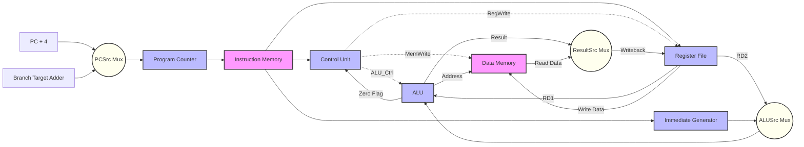

<div align="center">
  
  
  # Single-Cycle RISC-V Processor (RV32I)
  
  **A 32-bit single-cycle processor implementing the RISC-V base integer instruction set.**

  [](#)
  [](#)
  [](#)
  [](#)
</div>

---

## 📖 Project Overview

This repository contains the RTL (Register Transfer Level) design of a **32-bit Single-Cycle RISC-V Processor** written entirely in Verilog. It was built from the ground up to deeply understand the hardware-software interface, instruction decoding, and datapath logic inherent to modern microprocessor design. 

As an educational and portfolio piece, it translates the theoretical concepts from authoritative texts like *Computer Organization and Design (RISC-V Edition)* into a tangible, synthesizable hardware design.

### ✨ Highlights

| Feature | Specification |
| :--- | :--- |
| **ISA Supported** | Subset of RV32I (Base Integer Instruction Set) |
| **Processor Type** | Single-Cycle |
| **Datapath Width** | 32-bit |
| **Language** | Verilog HDL |
| **Architecture** | Harvard Architecture |
| **Design Methodology** | Modular RTL |
| **Simulation** | Xilinx Vivado / ModelSim / Icarus Verilog |

---

## 🏗️ Architecture Overview

The processor implements a classic Harvard architecture with separate instruction and data memories. It fetches, decodes, and executes instructions in a single clock cycle.

*   **Program Counter (PC):** A 32-bit register holding the address of the next instruction. Updated on the rising clock edge with an active-low synchronous reset.
*   **Instruction Memory:** A 4KB (1024x32) word-addressable read-only memory. Provides combinational read access.
*   **Register File:** A 32x32-bit dual-port memory. Register `x0` is hardwired to zero. Writes occur synchronously on the rising clock edge.
*   **Immediate Generator:** Sign-extends immediate values from I-type, S-type, and B-type instructions to 32 bits.
*   **ALU (Arithmetic Logic Unit):** Performs core arithmetic and logical operations. Computes Zero (Z), Negative (N), Overflow (V), and Carry (C) flags.
*   **Control Unit:** The brain of the processor. Comprises a Main Decoder and an ALU Decoder to generate multiplexer select lines and memory write enables purely combinationaly based on the Opcode and `funct3`/`funct7` fields.
*   **Data Memory:** A 4KB Random Access Memory module for load and store operations.
*   **Write-Back Multiplexer:** Selects between the ALU result and Data Memory read data to write back into the Register File.

### 🗺️ Datapath



*(Placeholder for High-Resolution Datapath Schematic)*
``

---

## 🚦 Control Signals

The Control Unit derives the following control signals to orchestrate the datapath:

| Signal | Description | 0 State | 1 State |
| :--- | :--- | :--- | :--- |
| **`RegWrite`** | Register File Write Enable | Do not write to Register File | Write to Register File |
| **`MemWrite`** | Data Memory Write Enable | Do not write to Data Memory | Write to Data Memory |
| **`ResultSrc`** | Write-Back Source | Use ALU Result | Use Data Memory output |
| **`ALUSrc`** | ALU Second Operand | Use `RD2` from Register File | Use Sign-Extended Immediate |
| **`PCSrc`** (`Branch`) | Next PC Selection | `PC + 4` | Branch Target (`PC + Imm`) |
| **`ImmSrc`** | Immediate Type | `00`=I-type, `01`=S-type | `10`=B-type |
| **`ALUOp`** | Intermediate ALU Control | `00`=Load/Store, `01`=Branch | `10`=R/I-type instructions |

---

## 🧩 Module Description

| Module Name | File Location | Purpose |
| :--- | :--- | :--- |
| `single_cycle_riscv` | `single_cycle_riscv.v` | Top-level module encapsulating and wiring all components together. |
| `program_counter` | `single_cycle_riscv.v` | Holds and updates the 32-bit instruction address. |
| `pc_adder` | `single_cycle_riscv.v` | Generic adder used for `PC+4` and Branch Target generation. |
| `instruction_memory` | `single_cycle_riscv.v` | Word-addressable ROM containing the executable machine code. |
| `register_file` | `single_cycle_riscv.v` | 32 x 32-bit CPU registers with dual asynchronous read ports. |
| `sign_extender` | `single_cycle_riscv.v` | Expands raw immediate fields into 32-bit signed values. |
| `alu` | `single_cycle_riscv.v` | Executes arithmetic and boolean logic operations. |
| `control_unit` | `single_cycle_riscv.v` | Instantiates `main_decoder` and `ALU_decoder`. |
| `main_decoder` | `single_cycle_riscv.v` | Generates datapath multiplexer/write enables based on the opcode. |
| `ALU_decoder` | `single_cycle_riscv.v` | Decodes `funct3`/`funct7` to specific 3-bit ALU operation signals. |
| `data_memory` | `single_cycle_riscv.v` | Synchronous write, asynchronous read RAM for `Load` and `Store` instructions. |

---

## 🛠️ Supported Instructions

This implementation focuses on a core subset of the RV32I specification, providing enough functionality to execute loops, arithmetic algorithms, and memory operations.

### R-Type (Register-Register)
| Instruction | Operation |
| :--- | :--- |
| `ADD` | Addition |
| `SUB` | Subtraction |
| `AND` | Logical AND |
| `OR` | Logical OR |
| `XOR` | Logical XOR |
| `SLT` | Set Less Than (Signed) |
| `SLTU` | Set Less Than (Unsigned) |

### I-Type (Register-Immediate & Load)
| Instruction | Operation |
| :--- | :--- |
| `ADDI` | Add Immediate |
| `ANDI` | AND Immediate |
| `ORI` | OR Immediate |
| `XORI` | XOR Immediate |
| `SLTI` | Set Less Than Immediate (Signed) |
| `SLTIU` | Set Less Than Immediate (Unsigned) |
| `LW` | Load Word |

### S-Type (Store)
| Instruction | Operation |
| :--- | :--- |
| `SW` | Store Word |

### B-Type (Branch)
| Instruction | Operation |
| :--- | :--- |
| `BEQ` | Branch if Equal |

*(Note: Jump instructions like `JAL`, `JALR`, and Upper Immediate instructions like `LUI`, `AUIPC` are planned for future iterations).*

---

## 📁 Directory Structure

```text
RISC-V/
├── RISC-V.srcs/
│   ├── sources_1/new/
│   │   └── single_cycle_riscv.v      # Single file containing all RTL modules
│   └── sim_1/imports/RISC-V/...
│       └── single_cycle_riscv.v      # Self-contained Verilog Testbench
├── program.mem.txt                   # Assembled machine code for simulation
├── RISC-V.xpr                        # Xilinx Vivado Project File
└── README.md                         # This file
```

---

## 💻 Simulation

The processor includes a fully self-contained testbench (`tb_single_cycle_riscv`) that pre-loads memory, stimulates the clock/reset, and automatically verifies register states.

### Prerequisites
*   Xilinx Vivado, Icarus Verilog (iverilog), or ModelSim.

### Running the Testbench (Vivado)
1. Open the project `RISC-V.xpr` in Vivado.
2. Ensure `program.mem.txt` is loaded into your simulation working directory.
3. Run the simulation. The testbench will execute the instructions and output verification results directly to the Tcl Console.

### Example Console Output
```bash
--- Testbench Started ---
Loading program.mem into instruction memory...
Reset Asserted (Active-Low)
Reset De-asserted. Processor running...
Program execution complete. Checking results...
--- Register File Verification ---
SUCCESS: All register checks passed!
--- Testbench Finished ---
```

*(Placeholder for Simulation Waveforms)*
``

---

## 📐 Design Decisions

*   **Single-Cycle Architecture:** Selected to deeply understand datapath interactions without the overhead of dealing with pipeline hazards, forwarding, and stalls.
*   **Combinational Control Logic:** Multiplexer selectors and ALU controls are purely combinational arrays. This avoids the latency of state machines, ensuring all instructions execute strictly within one clock cycle.
*   **Modular Implementation:** Extracted PC, Register File, ALUs, and Decoders into independent modules. This significantly eases testing and creates a clean transition path for future pipelining.
*   **Active-Low Synchronous Resets:** Implemented for reliable FPGA synthesis and predictable simulation startup states.

---

## ⚡ Performance Discussion

*   **Cycles Per Instruction (CPI):** Exactly **1.0**. Every instruction completes in a single clock cycle.
*   **Critical Path:** The maximum clock frequency ($F_{max}$) is severely limited by the critical path, which typically occurs during a Load instruction: `PC -> Instruction Memory -> Register File (Read) -> ALU -> Data Memory (Read) -> Mux -> Register File (Write)`.
*   **FPGA Suitability:** Readily synthesizable onto Xilinx FPGAs (Artix-7, Zynq). While resource utilization (LUTs/BRAMs) is optimal, clock scaling is inferior to pipelined alternatives.

---

## 🎓 Learning Outcomes

Developing this project provided deep hands-on experience with:
1.  **Hardware Description Languages:** Advanced Verilog paradigms, including blocking/non-blocking assignments and synthesizable memory structures.
2.  **Instruction Set Architectures (ISA):** The specific machine-code formats (R, I, S, B, U, J) of the RISC-V ISA and their binary alignment.
3.  **Digital Logic Design:** Deriving boolean logic for decoders and building stable edge-triggered sequential logic.
4.  **Verification:** Writing self-checking testbenches, generating clock stimulus, and avoiding simulation race conditions.

---

## 🚀 Future Improvements

To evolve this core into a production-grade microprocessor, the following upgrades are roadmapped:

*   [ ] **5-Stage Pipelining:** Split the datapath into Fetch, Decode, Execute, Memory, and Writeback stages to drastically improve clock speeds.
*   [ ] **Hazard Unit:** Implement Data Forwarding (Bypassing) and Stalling mechanisms for the pipeline.
*   [ ] **Full RV32I Compliance:** Implement `JAL`, `JALR`, `LUI`, `AUIPC`, and remaining Branch conditions (`BNE`, `BLT`, `BGE`).
*   [ ] **M-Extension (RV32M):** Add a Hardware Multiplier/Divider unit.
*   [ ] **Branch Prediction:** Add a Branch Target Buffer (BTB) to minimize pipeline flushes.
*   [ ] **Cache Hierarchy:** Integrate Level 1 Instruction and Data caches.

---

## 📚 References

1.  **Computer Organization and Design RISC-V Edition:** *The Hardware Software Interface* by David A. Patterson and John L. Hennessy.
2.  **The RISC-V Instruction Set Manual:** *Volume I: Unprivileged ISA*.
3.  **Digital Design and Computer Architecture (RISC-V Edition):** by Sarah Harris and David Harris.

---

## ⚖️ License

No license specified. Please contact the author for permissions regarding commercial use or redistribution.

---

## 🤝 Contributing

Contributions, issues, and feature requests are welcome!
If you'd like to contribute, please follow these steps:
1. Fork the Project.
2. Create your Feature Branch (`git checkout -b feature/AmazingFeature`).
3. Commit your Changes (`git commit -m 'Add some AmazingFeature'`).
4. Push to the Branch (`git push origin feature/AmazingFeature`).
5. Open a Pull Request.

---

## 👤 Author

**Krishna G** 
Hardware Design Engineer | Digital Logic Enthusiast

*Passionate about computer architecture, RTL design, and pushing the boundaries of what silicon can do.*

[](https://github.com/krishnag-12)

---

<div align="center">
  <b>If you found this processor design helpful or interesting, please consider giving it a ⭐!</b>
</div>
